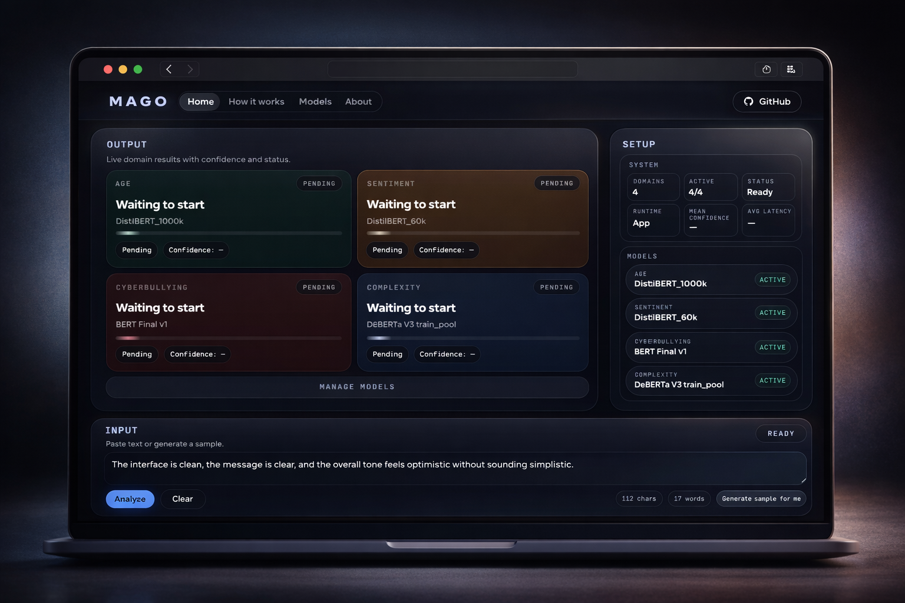

# MAGO — Multi-task Text Scoring System



**MAGO** is a multi-task Natural Language Processing (NLP) system capable of evaluating textual data across four distinct dimensions: sentiment, text complexity, author age group, and abusive content detection.

The project was developed as part of the course *Data Visualization and Text Mining* at Università Cattolica del Sacro Cuore (Milan) by four students:
- Georgii Kutivadze,
- Matteo Moltrasio,
- Orlando Pérez Basurto,
- Aleksandra Laricheva.

A full project report is included in `project-report` at the root of this repository.

---

## 1. Project Overview

MAGO trains and evaluates multiple model families for each NLP task:

- **Classical baselines** — TF-IDF features with Logistic Regression, SVM, XGBoost
- **Deep learning models** — GloVe embeddings with MLP, CNN, and BiLSTM architectures
- **Transformer models** — DistilBERT, RoBERTa via HuggingFace Transformers

Each task follows a consistent pipeline: data loading → preprocessing → model training → evaluation → result caching.

---

## 2. Repository Structure

### Task folders

Each of the four NLP tasks has its own folder and follows the same internal layout. Within each task folder, the following subdirectories are generated automatically during a run and are **not tracked in git**:

- `logs/` — training logs produced during model fitting
- `models/` — saved model checkpoints (**does not contain pre-trained weights**; model weights are stored on HuggingFace and linked in the notebooks)
- `outputs/` — evaluation results, plots, confusion matrices, and cached artifacts

> **No `data/` folder is included in this repository.** Datasets are hosted on HuggingFace and are either downloaded automatically on first run or can be loaded locally — both options are supported inside each notebook.

### Full structure

```
mago-text-scoring/
│
├── age/                        # Age group prediction task
│   ├── age-code.ipynb          # Main training & evaluation notebook
│   ├── datasets-preparation.ipynb  # Dataset preprocessing
│   └── environment.yml         # Task-specific Conda environment
│
├── complexity/                 # Text complexity assessment task
│   ├── complexity-code.ipynb   # Main training & evaluation notebook
│   ├── data-preparation.ipynb  # Dataset preprocessing
│   ├── local_deberta_resume.py # DeBERTa fine-tuning script (resumable)
│   └── environment.yml         # Task-specific Conda environment
│
├── sentiment/                  # Sentiment analysis task (7 classes)
│   ├── sentiment-code.ipynb    # Main training & evaluation notebook
│   └── environment.yml         # Task-specific Conda environment
│
├── abuse/                      # Abusive/hate speech detection task
│   ├── abuse-code.ipynb        # Main training & evaluation notebook
│   └── environment.yml         # Task-specific Conda environment
│
├── utils/                      # Shared utility modules (used by all notebooks)
│   ├── data.py                 # Data loading, splitting, encoding, dataset classes
│   ├── text.py                 # Text normalization and preprocessing
│   ├── metrics.py              # Evaluation metrics, results tracking, artifact caching
│   ├── plots.py                # Visualizations (confusion matrices, learning curves, UMAP)
│   ├── training.py             # Training loops, baseline builders, hyperparameter tuning
│   ├── models/
│   │   ├── architectures.py    # PyTorch model definitions (MLP, CNN, BiLSTM+Attention)
│   │   ├── inference.py        # Inference helpers for deep and transformer models
│   │   └── loading.py          # Model and artifact loading utilities
│   ├── tasks/
│   │   ├── sentiment.py        # Sentiment-specific label mapping and inference
│   │   ├── age.py              # Age binning, PAN dataset handling
│   │   ├── complexity.py       # Complexity task helpers
│   │   └── utils_abuse.py      # Abuse detection utilities
│   └── assets/                 # Repository assets (screenshots, etc.)
│
├── app/                        # FastAPI backend + React frontend (inference service)
│   ├── backend/                # REST API for model inference
│   ├── frontend/               # React + TypeScript dashboard
│   └── README.md               # Setup and usage instructions for the app
│
├── project-report              # Full project report
└── LICENSE
```

### Role of `utils/`

All four task notebooks share the same `utils/` package. It handles:
- data loading with caching fallback
- train/val/test splitting and label encoding
- building PyTorch datasets and HuggingFace Trainer bundles
- evaluation metrics (accuracy, F1-macro, F1-weighted, ROC-AUC)
- result persistence and cross-dataset comparisons
- visualizations and UMAP embeddings

Task-specific logic (label maps, dataset parsers) lives in `utils/tasks/`.

---

## 3. Setup Instructions

**1. Clone the repository**

```bash
git clone https://github.com/boblaros/mago-text-scoring.git
cd mago-text-scoring
```

**2. Create and activate the Conda environment**

Each task folder contains its own `environment.yml` with only the dependencies needed for that task (e.g., `sentiment/environment.yml`, `age/environment.yml`):

```bash
conda env create -f sentiment/environment.yml
conda activate nlp-project
```

**3. Launch JupyterLab**

```bash
jupyter lab
```

---

## 4. How to Run the Project

Each task has its own notebook. Open and run them independently:

| Task | Notebook |
|------|----------|
| Sentiment | `sentiment/sentiment-code.ipynb` |
| Age | `age/age-code.ipynb` |
| Complexity | `complexity/complexity-code.ipynb` |
| Abuse | `abuse/abuse-code.ipynb` |

**Steps within each notebook:**

1. Open the notebook in JupyterLab.
2. Run cells from top to bottom in order.
3. Dataset downloading and preprocessing happen automatically in the first sections.
4. Model training progresses through baselines → deep models → transformers.
5. Results and plots are saved automatically to the task's `outputs/` folder.

*Note:* Each notebook contains its own CFG (configuration) variable, which defines its workflow. The general structure of the CFG file is the same for all notebooks, but its contents depend on the specific task and settings. For instructions on how to run a specific notebook, see the introductory section at the beginning of each notebook.

**Datasets:**
- Datasets are hosted on [HuggingFace Datasets](https://huggingface.co/datasets) and are **not included** in this repository.
- Each notebook supports both automatic download from HuggingFace (on first run) and manual local loading — see the notebook's dataset section for details.

**App:**

The `app/` folder contains a separate FastAPI + React application for running model inference via a REST API. It provides a web dashboard where you can analyze text across all four domains interactively. See [`app/README.md`](app/README.md) for full setup and usage instructions.

---

## 5. Notes

- **Training time:** Transformer models (DistilBERT, RoBERTa, DeBERTa) require significant compute. GPU is strongly recommended.
- **Automatic downloads:** Pre-trained model weights (GloVe embeddings, HuggingFace models) are downloaded automatically the first time a cell runs.
- **Model weights:** Trained model weights are not stored in this repository. Links to HuggingFace model checkpoints are provided within the respective notebooks.
- **Caching:** Results and preprocessed data are cached locally. Re-running a notebook skips expensive steps if outputs are already present.
- **Reproducibility:** All experiments use a fixed random seed (`seed=42`).
